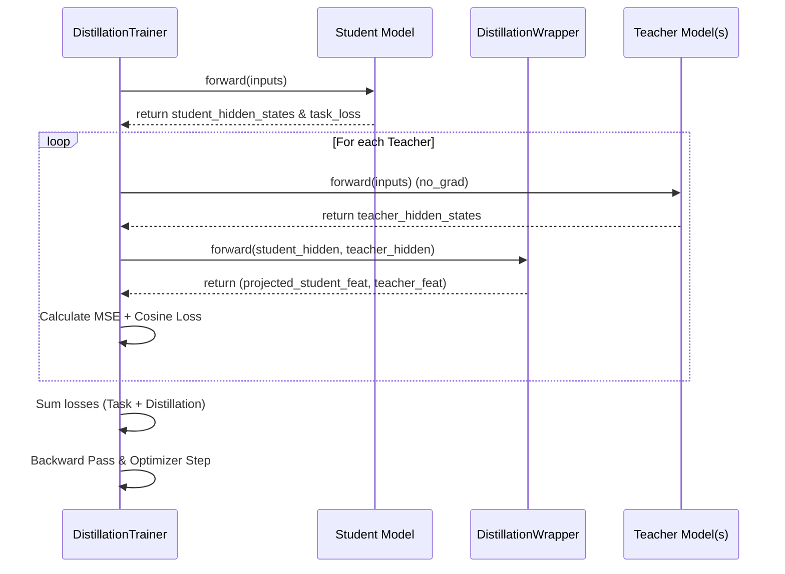

# Execution Flow: Multi-Teacher Distillation

This document traces the sequence of function calls and logic execution from the moment you run `python train.py`.

## 1. Top-Level Orchestration (`train.py`)

The process starts in `main()` and follows a recursive sequence for each student model in the chain.

| Sequence | Function/Step | Description |
| :--- | :--- | :--- |
| **1** | `main()` | The entry point. It sets up the `model_chain` and calls the dataset preparation. |
| **2** | `get_distillation_dataset()` | Loads tokens, filters text, and prepares the PyTorch dataset. |
| **3** | **Loop Starts** | Iterates through each student model in the `model_chain`. |
| **4** | `run_distillation_step()` | Orchestrates a single training event for the current student. |
| **5** | `AutoModel.from_pretrained()` | Loads the teacher models (preceding models in the chain). |
| **6** | `get_layer_mapping()` | Calculates which teacher layers should map to which student layers based on depth. |
| **7** | `FeatureDistillationWrapper()` | Initializes projection layers for each teacher-student pair. |
| **8** | `DistillationTrainer()` | Initializes the trainer with the student and teacher wrappers. |
| **9** | `trainer.train()` | Starts the standard Hugging Face training loop. |

---

## 2. Training Loop Execution (`trainer.py`)

Once `trainer.train()` is called, the library manages the epochs and batches. For every individual training step, the following happens:

---

## 3. Function Breakdown by File

### `distillation/dataset.py`
1.  **`get_distillation_dataset`**: Only called **once** at the very beginning to avoid redundant processing.
2.  **`tokenize_function`**: Called internally by the `map` function to process text.

### `distillation/model.py`
1.  **`get_layer_mapping`**: Called inside `run_distillation_step` to decide depth alignment.
2.  **`FeatureDistillationWrapper.forward`**: Called **every batch** inside the trainer's loss calculation. It performs the linear projection of features.

### `distillation/trainer.py`
1.  **`DistillationTrainer.__init__`**: sets teachers to `eval()` mode and freezes parameters.
2.  **`compute_loss`**: The most critical function. It is called **every step** to aggregate the LM loss and the feature alignment losses from all teachers.

---

## 4. Finalization
After the loop in `run_distillation_step` completes:
1.  **`student.save_pretrained()`**: The newly trained student is saved to disk.
2.  **`all_preceding_paths.append()`**: The saved path is added to the teacher list for the next student in the chain.
