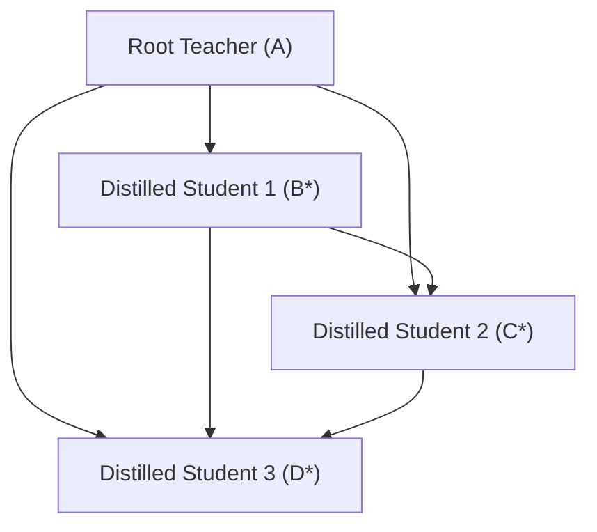

# Deep Dive: Training Orchestration (`train.py`)

This document provides an in-depth explanation of the orchestration logic used to implement **Cumulative Multi-Teacher Distillation**.

## 1. The Core Innovation: Cumulative Feedback

Traditional distillation is usually a 1-to-1 process: `Teacher -> Student`. This script implements a **recursive pipeline** where the pool of knowledge grows with every step.

### Cumulative Knowledge Chain
Imagine a model chain: `[A, B, C, D]` where $A$ is the largest (Root Teacher) and $D$ is the smallest.

1.  **Step 1**: Distill $B$ using $\{A\}$ as the teacher.
2.  **Step 2**: Distill $C$ using $\{A, B^*\}$ as teachers. (where $B^*$ is the distilled version of $B$).
3.  **Step 3**: Distill $D$ using $\{A, B^*, C^*\}$ as teachers.



**Why do this?**
Smaller models often struggle to learn directly from massive "unreachable" teachers. By providing intermediate students (which are closer in capacity to the current student) as additional teachers, we provide "stepping stones" for the knowledge transfer.

---

## 2. Technical Workflow: `run_distillation_step`

This function is the "Engine" of the project. It executes one full training loop for a specific student.

### Phase A: Architecture Alignment
For every teacher passed to the step:
1.  **Layer Selection**: `get_layer_mapping` determines which teacher layers are most informative for the student's depth.
2.  **Projection Initialization**: A `FeatureDistillationWrapper` is created. It adds specialized "Projection Heads" to the student that translate its internal thoughts into the "language" of that specific teacher.

### Phase B: Memory Optimization
Since we are loading multiple LLMs into VRAM simultaneously, the script uses several "surgical" optimizations:
-   **Teacher Freezing**: `param.requires_grad = False` ensures PyTorch doesn't allocate memory for gradients of the teachers.
-   **Evaluation Mode**: `model.eval()` disables Dropout and Batch Normalization buffers in teachers, ensuring consistent feature extraction.
-   **Aggressive Accumulation**: By setting `batch_size=1` and `accumulation=8`, we simulate a larger batch size without the massive VRAM footprint of 8 concurrent forward passes.

### Phase C: The Unified Trainer
The `DistillationTrainer` is initialized with the student and a **list** of wrappers and teachers. During the forward pass, it calculates a "Consensus Loss" — the student is punished if its internal features deviate from the consensus of all its teachers.

---

## 3. The `main()` Loop Logic

The `main()` function manages the `all_preceding_paths` list.

```python
all_preceding_paths = [model_chain[0]] # Start with just the Root Teacher

for i in range(1, len(model_chain)):
    # ... Training ...
    saved_path = run_distillation_step(...)
    
    # CRITICAL STEP:
    all_preceding_paths.append(saved_path)
```

By appending the locally saved path of the *previously distilled model* to the teacher list, the script ensures that the next student in the chain benefits from the refinement performed in the previous steps.

---

## 4. Troubleshooting & Performance

### VRAM Scaling
The memory usage grows linearly with the number of teachers:
-   **1 Teacher**: ~2x Student VRAM
-   **2 Teachers**: ~3x Student VRAM
-   **N Teachers**: ~ (N+1)x Student VRAM

If you encounter `OutOfMemory` errors, you can modify `train.py` to only pass the *last N* models as teachers instead of the entire history.

### Checkpointing
The script is configured to `save_strategy="no"` during the loop to save disk space, only performing a final `save_pretrained` at the end of each step. This ensures that only the fully "cooked" model is carried forward.
